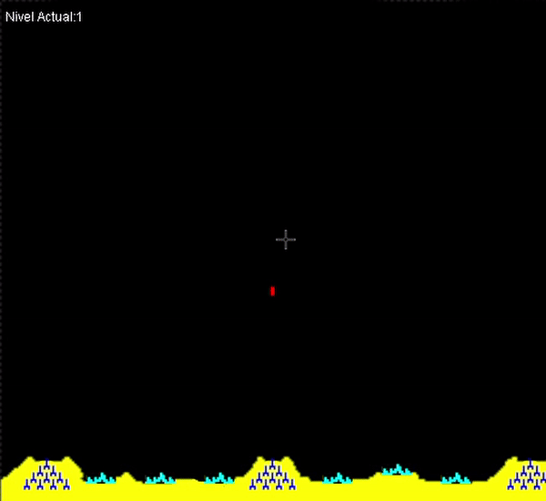
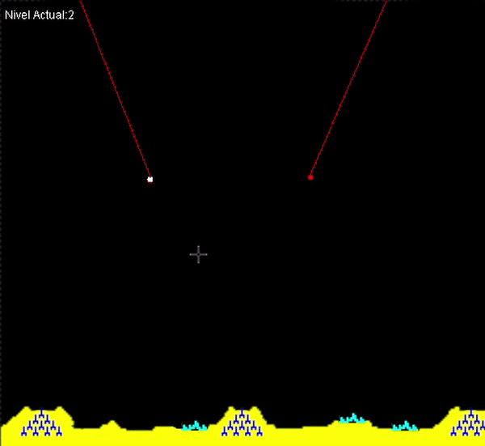
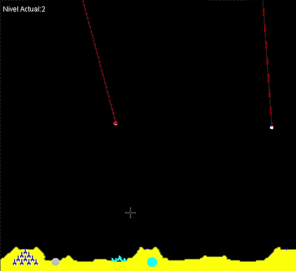

# Missile-Command

<h1>Proyecto de juego basado en el clásico Missile Command</h1>
<h2>Lenguaje: JAVA</h2>

<h4>Menu interactivo con opciones de display</h4>

<h4>Primer nivel enemigos básicos</h4>

<h4>Enemigo satelite </h4>

<h4>Enemigos avion</h4>

